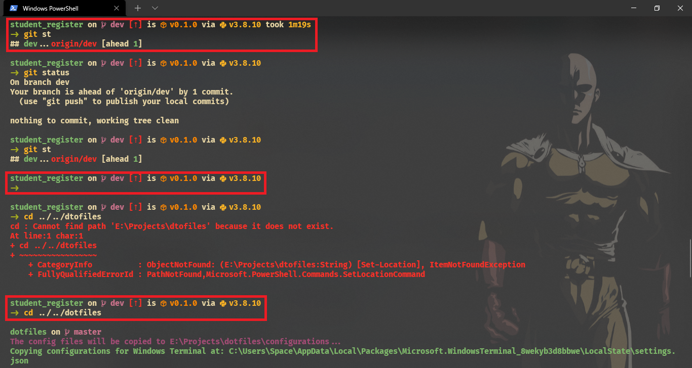

# Starship

[Starship][Starship] is a cross-platform customizable prompt which was written in Rust & is **super-fast**. Also, unlike most other prompt customization tools, Starship requires close to none customizations. It just works pretty well (_and beautifully_) right out of the box!

That said, you can have a look at the `starship.toml` files & see it's pretty minimal. But don't be fooled with the minimal configurations! Take a look & see for yourself what this minimally configured prompt looks like on Windows Terminal:



**NOTE**: _The areas marked with red boxes are the shell prompts._

So, if it piqued your interests now, read ahead. In this README you'll find all the instructions to properly set up Starship on your Windows machine as well.

## Setting Up Starship
<!-- TODO: Recommend the automated install script -->
1. First off, download the required binary from GitHub: [Starship Binaries][Starship Binaries]
2. Extract the zipped files to `%SYSTEMDRIVE%\Tools`.
3. Ensure the above path is added to System Path using the Environment Variable `$PATH`.
4. Add the following lines to your `$PROFILE` file with the following lines:

    ```powershell
    # Loads the Starship prompt for PowerShell
    Invoke-Expression (&starship init powershell)

    # Configures the %TEMP% folder for Starship caching
    $ENV:STARSHIP_CACHE = Resolve-Path -Path $ENV:TEMP

    # Configures the path to the starship.toml file
    $ENV:STARSHIP_CONFIG = Resolve-Path -Path "$ENV:USERPROFILE\.starship\starship.toml
    ```

5. Then create a `.starship` directory at `%USERPROFILE%`. The `starship.toml` file will go inside the `.starship` folder.
6. Copy of the contents of [starship.toml](starship.toml) in this repository to the file you just created.

    Contents of the [starship.toml](starship.toml) file in this repo:

    ```toml
    [character]
    success_symbol = "[->](bold green)"

    [docker_context]
    symbol = " "

    [package]
    symbol = " "

    [python]
    symbol = " "

    [git_branch]
    symbol = " "
    remote_branch = "main"
    remote_name = "github"
    ```

    **NOTE**: Some contents has been removed from the [starship.toml](starship.toml) file. Refer to the hyperlink for a better reference.

7. Then run the `. $Profile` to reload the PowerShell profile.
8. Enjoy & share a screenshot of your terminal with the rest of the world!

## Quick Setup Using PowerShell Command

It's possible & actually recommended to use PowerShell Cmdlets to quicky set up the environment. You should do it moreso if it's only Starship that you want & not everything else I use here.

That said, add the following commands to a PowerShell session. And here's a tip for you, use [Windows Terminal](../windows-terminal).

```powershell
# Create the necessary folders first
New-Item -ItemType "Directory" -Path "$ENV:HOMEDRIVE\Tools", "$ENV:USERPROFILE\.starship" -Force

# Create the Starship configuration file
New-Item -ItemType "File" -Path "$ENV:USERPROFILE\.starship\starship.toml"

# TODO: Download the Starship binary

# TODO: Add the Starship binary to System Path 

# TODO: Add content to the $PROFILE

# TODO: Add content to the $ENV:USERPROFILE\.starship\starship.toml file
$StarshipConfigs = https://raw.githubusercontent.com/Jarmos-san/dotfiles-windows/master/configurations/starship/starship.toml
Set-Content -Path "$ENV:USERPROFILE\.starship\starship.toml" -Value (Invoke-WebRequest -Uri $StarshipConfigs).Content

# Reload your current PowerShell session
. $Profile
```

## Notes to Remember

Do note, I'm using the patched version of Fira Code. It's available at [Nerd Fonts][Nerd Fonts], so do check it out if you want a similar experience. Also, by default Starship uses emojis in the prompt which I dislike. Hence, I replaced them with Nerd Font icons!

So, if you want to customize your Starship prompt according to your needs, definitely refer to the official [configuration docs][Starship Configurations].

<!-- Reference Links -->
[Starship]: https://starship.rs/
[Starship Binaries]: https://github.com/starship/starship/releases
[Nerd Fonts]: https://www.nerdfonts.com/
[Starship Configurations]: https://starship.rs/config/
